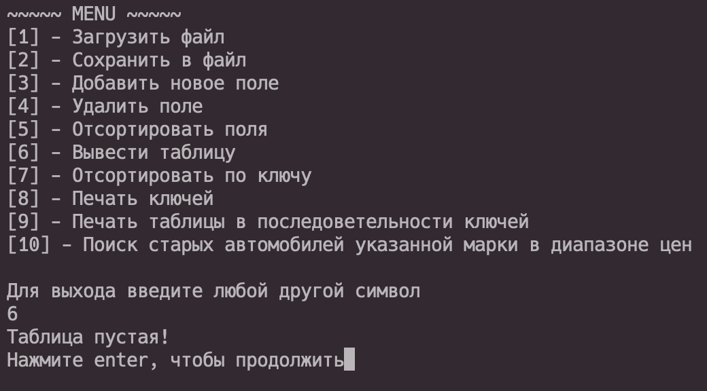
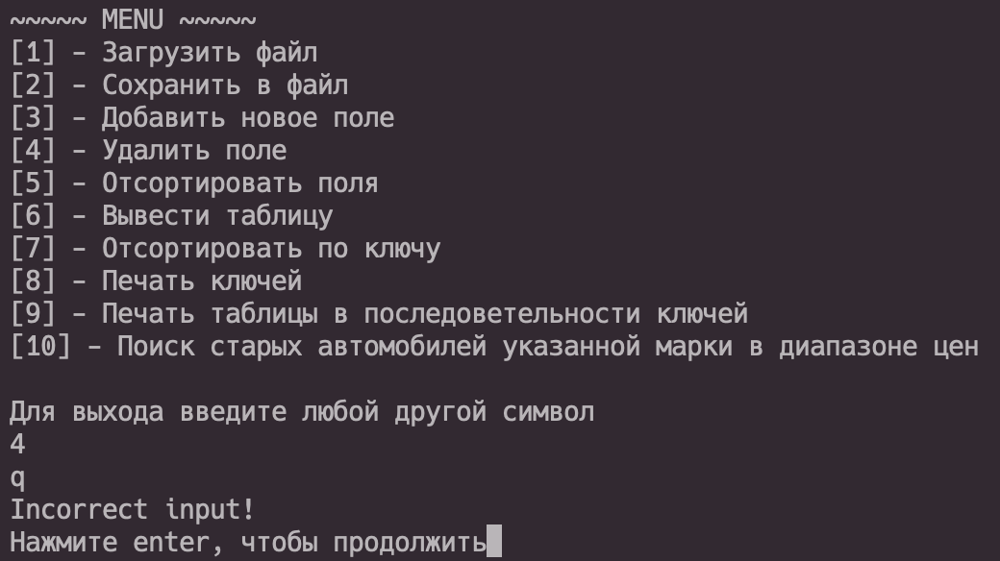
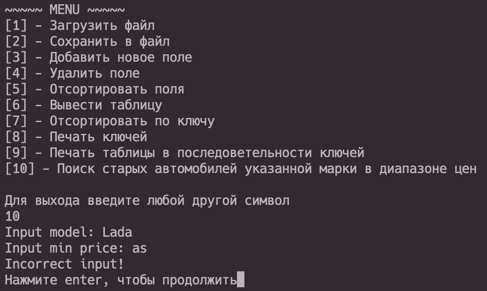
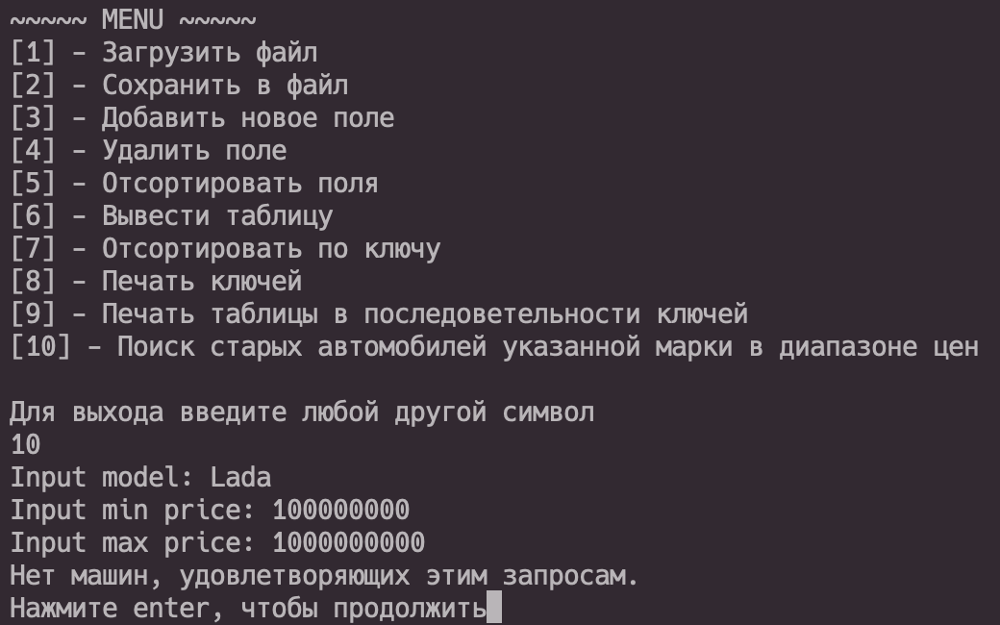
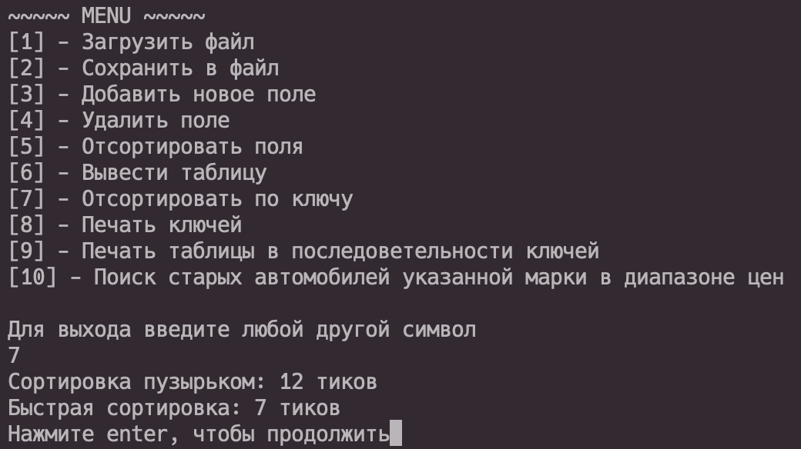
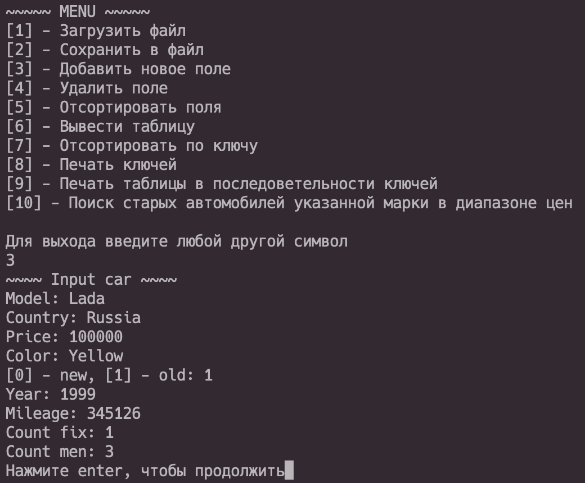

### *Степанов Александр ИУ7-33Б*

# Лабораторная работа 2: *Записи с вариантами. Обработка таблиц.*

## Задание

Приобрести навыки работы с типом данных «запись» («структура»), содержащим вариантную часть, и с данными, хранящимися в таблицах. Оценить относительную эффективность программы (в процентах) по времени и по используемому объему памяти в зависимости от используемого алгоритма и от объема сортируемой информации.

Ввести список машин, имеющихся в автомагазине, содержащий марку автомобиля, страну-производитель, цену, цвет и состояние: новый – гарантия (в годах); нет - год выпуска, пробег, количество ремонтов, количество собственников. Вывести цены не новых машин указанной марки с одним предыдущим собственником, отсутствием ремонта в указанном диапазоне цен.

**Входные данные:** файл, содержащий список автомобилей с информацией о них, возможно добавлять запись вручную.

**Выходные данные:** отсортированая по ценам таблица автомобилей, время на сортировку, поиск не новых машин указанной марки с одним предыдущим собственником, отсутствием ремонта в указанном диапазоне цен.

## Взаимодействие с программой:

```
~~~~~ MENU ~~~~~
[1] - Загрузить файл
[2] - Сохранить в файл
[3] - Добавить новую запись
[4] - Удалить запись
[5] - Отсортировать записи таблицы
[6] - Вывести таблицу
[7] - Отсортировать таблицу ключей
[8] - Печать ключей
[9] - Печать таблицы в последоветельности ключей
[10] - Поиск старых автомобилей указанной марки в диапазоне цен

Для выхода введите любой другой символ
```

## Используемые структуры

**Запись таблицы автомобилей**

```cpp
struct Car
{
    string model;					// Название модели
    string country;					// Страна производитель
    int price;						// Цена автомобиля
    string color;					// Цвет автомобиля
    
    int mode;						// 1 - старый, 0 - новый

    union 
    {        
        struct
        {
            int guarantee;			// Гарантия
        } new_car;

        struct
        {
            int year;				// Год производства
            int mileage;			// Пробег
            int count_fix;			// Количество починок
            int count_men;			// Количество владельцев
        } old_car;
    } cond;
};
```
**Запись таблицы ключей**

```cpp
struct Key 
{
    int id;							// id записи
    int price;						// Цена автомобиля
};
```

## Алгоритмы

1. **Считывание таблицы из файла**

	```cpp
	vector<struct Car> data_file(vector<struct Key> &keys)
	```
	Производится поэлементное считывание из файла. Возвращает таблицу и создает таблицу ключей.

2. **Сохранение таблицы в файл**

	```cpp
	void write_to_file(vector<struct Car> data)
	```
	Записывает таблицу в файл.
	
3. **Добавление записи**
	
	```cpp
	int add_car(vector<struct Car> &data, vector<struct Key> &keys)
	```
	Добавляет запись в конец таблицы, обновляет таблицу ключей. Возвращает INCORRECT_INPUT в случает некоректного ввода и SUCCESS в случае удачного добавления.
	
4. **Удаление записи**

	```cpp
	int remove_car(vector<struct Car> &data, vector<struct Key> &keys)
	```
	Удаляет машину из таблицы по введенному id, обновляет таблицу ключей. Возвращает INCORRECT_INPUT в случает некоректного ввода и SUCCESS в случае удачного удаления.
	
5. **Сортировка таблицы**
	
	```cpp
	void sort_data(vector<struct Car> &data)
	```
	Сортирует таблицу по цене алгоритмом сортировки пузырьком.
	
6. **Печать таблицы**
	
	```cpp
	ostream& operator << (ostream &output, vector<struct Car> &data)
	```
	Выводит таблицу на экран.
	
7. **Сортировка таблицы ключей**
		
	```cpp
	void sort_keys(vector<struct Key> &keys)
	```
	Сортирует таблицу ключей по цене алгоритмом мортировки пузырьком
	
8. **Печать таблицы ключей**
	
	```cpp
	ostream& operator << (ostream &output, vector<struct Key> &keys)
	```
	Выводит  таблицу ключей.
	
9. **Печать таблицы по ключам**
	
	```cpp
	void print_with_keys(vector<struct Car> data, vector<struct Key> keys)
	```
	Выводит таблицу в порядке ключей.
	
10. **Поиск**
	
	```cpp
	int search(vector<struct Car> data)
	```
	Производит поиск и выводит не новые машины указанной марки с одним предыдущим собственником, отсутствием ремонта в указанном диапазоне цен. Возвращает INCORRECT_INPUT в случает некоректного ввода и SUCCESS в случае удачного удаления.

## Тесты

### Некорректные данные

1. **Таблица пустая**
	
	
2. **Некорректные данные при вводе**
	
	
	
3. **Не найден элемент**
	
	
4. **Поиск не дал результатов**
	

### Корректные данные

5. **Сортировка**
	

6. **Добавление записи**
	
	
7. **Удачный поиск**
	

## Сравнение времени
|1280 элементов|Таблица машин|Таблица ключей|Эффективность|
|---|---|---|---|
|Пузырек|63628 тиков|7356 тиков|89%|
|Быстрая|281 тиков|96 тиков|66%|

## Используемая память
|Таблица автомобилей (Б)|Таблица ключей (Б)|Эффективность|
|---|---|---|
|104|112|4%|

## Контрольные вопросы

1. **Как выделяется память под вариантную часть записи?** <br>Для определения вариатной записи используется ключевое слово union. Память под него выделяется по размеру самого большого поля.<br><br>
2. **Что будет, если в вариантную часть ввести данные, несоответствующие описанным?**<br>Произойдет некорректная работа с памятью, так как поля вариатной записи хранятся в одной области памяти.<br><br>
3. **Кто должен следить за правильностью выполнения операций с вариантной частью записи?**<br>За правильностью выполнения операций с вариатной записью следит программист<br><br>
4. **Что представляет собой таблица ключей, зачем она нужна?**<br>Таблица ключей - это таблица, содержащая индекс элемента таблицы и ключ. Она нужна для эффективной работы со временем и памятью во время сотртировки.<br><br>
5. **В каких случаях эффективнее обрабатывать данные в самой таблице, а когда – использовать таблицу ключей?**<br>При сортировке таблицы эффективней по времени использовать таблицу ключей, но для их хранения требуется дополнительная память<br><br>
6. **Какие способы сортировки предпочтительнее для обработки таблиц и почему?**<br>Для сортировки таблиц, как и при любых сортировках, эффективнее всего использовать быструю сортировку, так как меньше перестановок. При небольшом количестве записей или полей, эффективней не использовать таблицу ключей.

## Вывод
При сортировке большого количества данных эффективно использовать таблицу ключей, так как она дает большой выйгрыш по времени. Но при обработке небольших данных выйгрыш небольшой, поэтому лучше сэкономить память и не хранить таблицу ключей.

